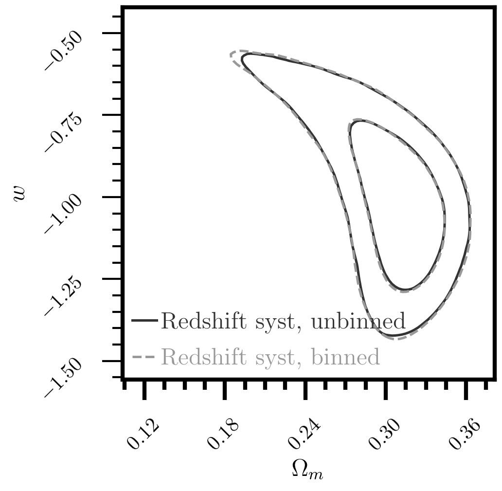
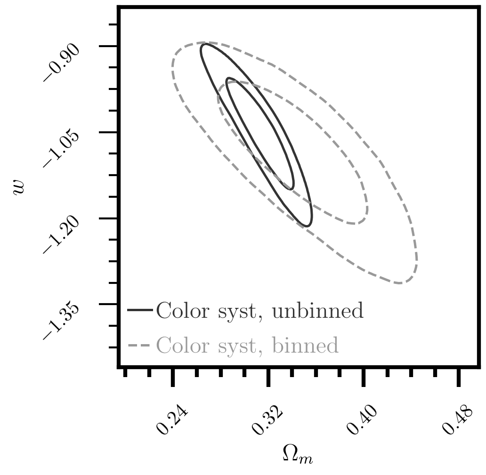

This repository provides a simple validation that redshift binning of distances causes lost
information in covariance matrices, which leads to inflated model uncertainty.

To do this, we first contruct a toy supernova model. No observational uncertainty, no
selection effects, bias corrections, contamination, nothing.

We then add, using the same methodology as has been used in past literature, systematic uncertainty
to the observational covariance matrix by incoporating the shift in distances between systematics.

By comparing the unbinned to the binned fitting, you will be able to see that *any* systematic which
affects both redshift and any other parameter (which is, as far as I know, all of them), will thus
overestimate the uncertainty.

Run `main.py` to run/load fits and generate plots. Chains are saved in the `chains` directory (delete this to refit),
and plots are in the aptly named `plots` directory.

To install, ensure you have Python 3.6+ and dependencies (`pip install -r requirements`).

Here are the main two take away plots:

 